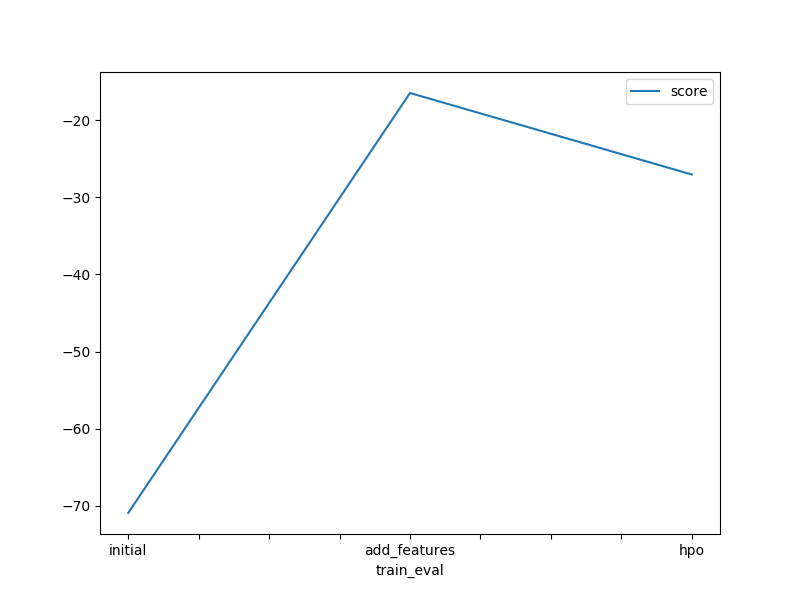
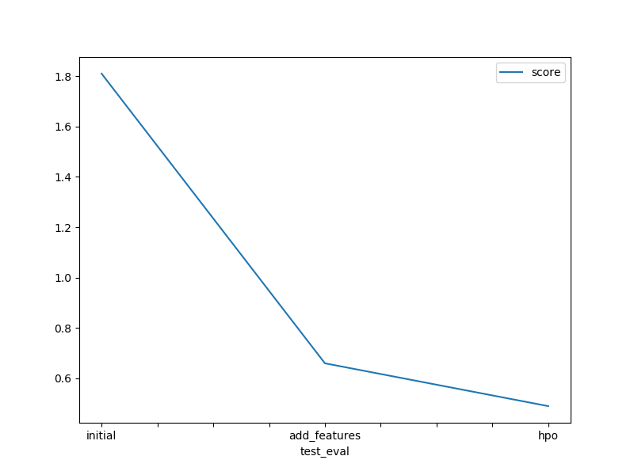

# Report: Predict Bike Sharing Demand with AutoGluon Solution
#### Sumit Garg

## Initial Training
### What did you realize when you tried to submit your predictions? What changes were needed to the output of the predictor to submit your results?
The logic behind initial training is to create a baseline model that can be used for further processing. As suggested in the notebook, we checked for values less than -1 but there was none. We did not make any change to the predictions before submitting it to Kaggle.

### What was the top ranked model that performed?
Best model was WeightedEnsemble_L3.

## Exploratory data analysis and feature creation
### What did the exploratory analysis find and how did you add additional features?
There was a datetime column in the dataset which had hourly values. It was a good idea to create several other columns like year, month, day and hour. We created all of these features.

Also, There were two categorical features in the dataset: weather and season. Autogluon was considering these features as numbers, we changed their data type to categories using astype functions.

### How much better did your model preform after adding additional features and why do you think that is?
Feature engineering process improved model performance drastically. The score improved from 1.81 to 0.66.

## Hyper parameter tuning
### How much better did your model preform after trying different hyper parameters?
After hyperperameter tuning model performance was 0.49 which is acceptable.

### If you were given more time with this dataset, where do you think you would spend more time?
We could work on feature engineering as we noticed that it had significant difference on the performance.
We might spend some time on hyperparameter tuning as well.

### Create a table with the models you ran, the hyperparameters modified, and the kaggle score.
|model|hpo1|hpo2|hpo3|score|
|--|--|--|--|--|
|initial|WeightedEnsemble_L3|time_limit=600|presets=best_quality|eval_metric=root_mean_squared_error|
|add_features|WeightedEnsemble_L3|time_limit=600|presets=best_quality|eval_metric=root_mean_squared_error|
|hpo|WeightedEnsemble_L3|time_limit=600|presets=best_quality|eval_metric=root_mean_squared_error|

### Create a line plot showing the top model score for the three (or more) training runs during the project.

### Create a line plot showing the top kaggle score for the three (or more) prediction submissions during the project.

## Summary
The project was to predict the bike demand for future. We were provided with two datasets, train.csv: to train the model, test.csv: to test the performance of our models. First, we created a baseline model and found that we if used the data as it is then the model performs terriblly so we need to perform EDA on the dataset. We did feature engineering and noticed that model performed very well. 
When we further fine tuned the model, we were able to achieve a score of 0.49.